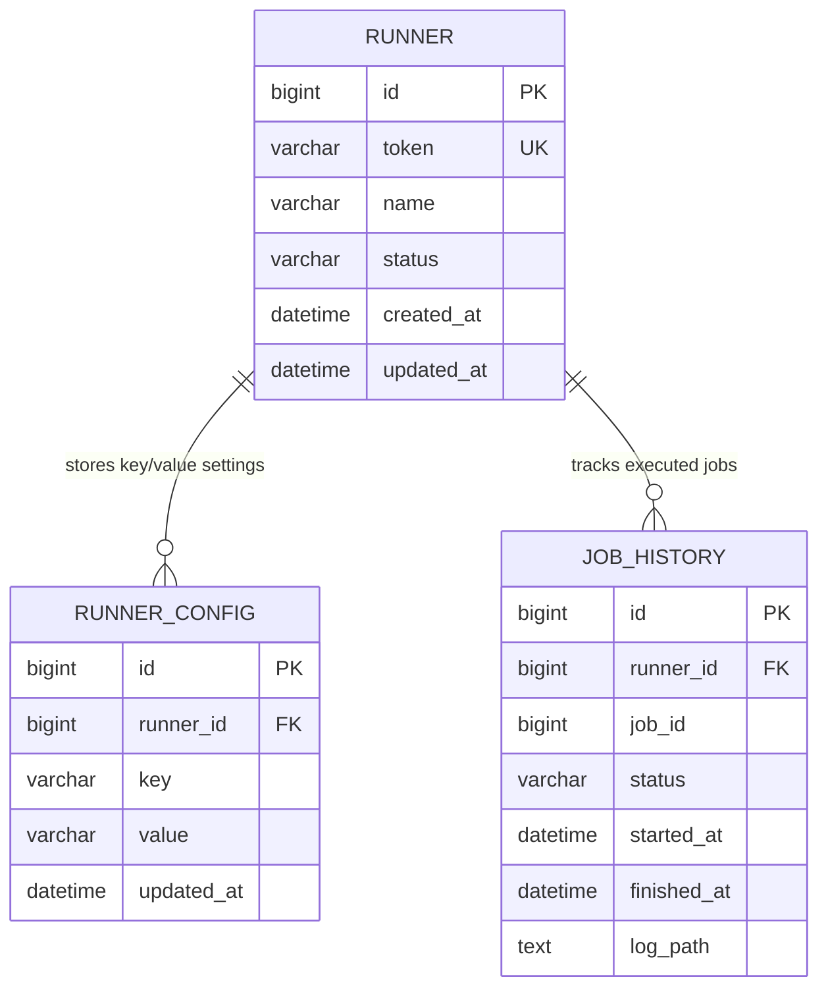

# Runner Scheduler ERD

## 엔터티 설명

- **RUNNER**: 서버와 연동된 러너 인스턴스 등록 정보. 토큰, 상태, 등록/갱신 시각을 관리합니다.
- **RUNNER_CONFIG**: 러너별 스케줄러/실행에 필요한 설정을 key-value 형태로 저장합니다. 서버가 템플릿을 내려줄 때 이 테이블을 갱신합니다.
- **JOB_HISTORY**: 러너가 처리한 Job 히스토리와 상태, 실행 시간, 로그 위치 등을 기록합니다. 스케줄러 모니터링 및 재시도 근거로 활용됩니다.

Runner 애플리케이션은 초기 연동 시 RUNNER/RUNNER_CONFIG를 통해 서버 템플릿을 로컬에 캐시하고, 이후 스케줄러가 JOB_HISTORY에 실행 내역을 적재하여 상태를 추적합니다.
